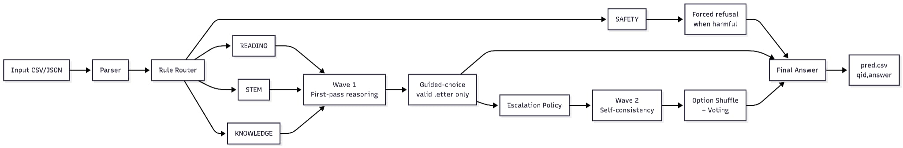

# Báo Cáo Phương Pháp VietMind MCQ

| Mục                   | Giá trị                                                                           |
| ---------------------- | ----------------------------------------------------------------------------------- |
| Đội thi              | Cow                                                                                 |
| Dự án                | VietMind MCQ                                                                        |
| Cuộc thi              | HackAIthon 2026, Track C, Innovator                                                 |
| Docker image cuối     | `powato/hackaithon-cow:latest`                                                    |
| Runner cuối           | `src/v03_gamma.py`                                                                |
| Mô hình              | `Qwen/Qwen3.5-4B`                                                                 |
| Giới hạn mô hình   | Một LLM mở, dưới 5B tham số                                                    |
| Điểm public          | 85.96 phần trăm trên public set 463 câu                                         |
| Độ chính xác proxy | 91.58 phần trăm, 424 / 463, so với bộ đáp án tham chiếu nội bộ của nhóm |

## 1. Bài Toán Và Yêu Cầu Nộp Bài

Track C yêu cầu mỗi đội nộp một Docker container offline, đọc file test từ
`/data` và ghi `/output/pred.csv` với đúng hai cột: `qid,answer`. Private test
dự kiến lớn hơn public set nhiều, nên hệ thống của chúng tôi được thiết kế
quanh ba mục tiêu:

| Mục tiêu          | Vì sao quan trọng                                                                                                                            |
| ------------------- | ---------------------------------------------------------------------------------------------------------------------------------------------- |
| Độ chính xác    | Đây là thành phần điểm chính, nên mô hình cần giải đúng nhiều dạng câu hỏi trắc nghiệm tiếng Việt.                     |
| Tốc độ inference | Private set khoảng 2000 câu, nên hệ thống quá chậm có thể mất điểm thời gian hoặc không chạy xong.                             |
| Độ ổn định     | Container crash, OOM, hoặc output sai định dạng có thể làm hỏng toàn bộ bài nộp, ngay cả khi mô hình có độ chính xác tốt. |

Hệ thống cuối chỉ dùng một LLM mở: `Qwen/Qwen3.5-4B`, nằm dưới giới hạn 5B tham
số. Hệ thống chạy offline khi inference và không dùng RAG, embedding model,
reranker, API bên ngoài, hoặc LLM thứ hai.

Điểm số không chỉ phụ thuộc vào accuracy. Rubric cũng chấm tốc độ inference và
ý tưởng sáng tạo trong kiến trúc. Vì vậy, chúng tôi xem tối ưu hóa là một phần
của thiết kế mô hình. Một hệ thống có public accuracy cao hơn một chút không
tốt hơn nếu nó có nguy cơ fail hoặc timeout trên private set lớn hơn.

## 2. Ý Tưởng Chính

VietMind MCQ là một agent suy luận thích ứng cho câu hỏi trắc nghiệm tiếng
Việt. Ý tưởng chính rất đơn giản: không phải câu hỏi nào cũng nên nhận cùng
một lượng tính toán.

Thiết kế này đến từ trải nghiệm của chính chúng tôi với các kỳ thi đại học
ở Việt Nam. Khi còn là học sinh phổ thông, chúng tôi học được rằng câu kiến
thức đơn giản có thể trả lời nhanh, bài toán thường cần nháp, câu đọc hiểu
thường cần quay lại đoạn văn, và các đáp án dễ nhầm lẫn cần so sánh kỹ.
VietMind MCQ làm theo bản năng làm bài đó.

Hệ thống trước hết nhận diện dạng câu hỏi, sau đó quyết định nên dành bao nhiêu
suy luận cho câu đó. Đây là phần sáng tạo chính của kiến trúc: mô hình không bị
yêu cầu trả lời mọi câu theo một cách chung chung. Nó được hỗ trợ bởi một lớp
chiến lược làm bài nhỏ, quyết định khi nào nên trả lời nhanh và khi nào nên
chậm lại.

## 3. Kiến Trúc Cuối

Pipeline cuối `v03_gamma` là một hệ thống xử lý theo wave batch và theo route.

Router gán mỗi câu hỏi vào một trong bốn route:

| Route         | Tín hiệu                                                                        | Cách xử lý                                                                                                               |
| ------------- | --------------------------------------------------------------------------------- | --------------------------------------------------------------------------------------------------------------------------- |
| `READING`   | Đoạn văn, ngữ cảnh, truy xuất chi tiết, câu hỏi lý do hoặc mục đích | Self consistency kiểu đọc lại cho các câu cần bằng chứng chính xác.                                              |
| `STEM`      | Công thức, đại lượng, tính toán, suy luận khoa học hoặc toán          | Suy luận kỹ hơn và self consistency vì lỗi tính toán nhỏ có thể làm đổi đáp án.                            |
| `KNOWLEDGE` | Nhớ khái niệm, nhiều lựa chọn, lựa chọn mơ hồ, đáp án dạng tổ hợp | Trả lời trực tiếp với câu đơn giản, cấp thêm compute cho câu nhiều lựa chọn hoặc cấu trúc đáp án khó. |
| `SAFETY`    | Mẫu câu yêu cầu hành vi nguy hiểm và có lựa chọn từ chối              | Xử lý đáp án từ chối theo luật khi phù hợp.                                                                       |

Sau bước suy luận, hệ thống dùng constrained extraction. Thay vì tin hoàn toàn
vào chuỗi trả lời tự do, hệ thống yêu cầu mô hình chọn trong các nhãn hợp lệ của
câu hỏi đó. Điều này giảm output không hợp lệ và hỗ trợ cả câu hỏi có nhiều hơn
bốn lựa chọn.

Kiến trúc cuối cũng dùng option shuffle voting trong self consistency. Cách này
giảm thiên lệch vị trí vì mô hình không luôn nhìn thấy cùng một đáp án ở cùng
một nhãn.

## 4. Vì Sao Chọn Qwen3.5 4B

Giới hạn cuộc thi và phần cứng mục tiêu khiến lựa chọn mô hình phải thực tế, chứ
không chỉ là lý thuyết. Chúng tôi cần một mô hình đủ nhỏ cho 16 GB VRAM, đủ mạnh
cho suy luận tiếng Việt, và phù hợp với đường chạy Docker offline đơn giản.

`Qwen/Qwen3.5-4B` cho chúng tôi điểm cân bằng tốt nhất. Mô hình đủ nhỏ để phù
hợp phần cứng mục tiêu, đủ mạnh để hưởng lợi từ prompt suy luận, và đủ nhanh cho
private set 2000 câu khi kết hợp với wave batching và safe mode.

Sau khi public score tăng, chúng tôi có cân nhắc các ý tưởng nặng hơn, nhưng
đường chạy cuối vẫn được giữ thận trọng vì khả năng hoàn thành bài chạy cũng là
một phần của điểm thực tế.

## 5. Lịch Sử Các Phiên Bản

Chúng tôi không đi thẳng đến `v03_gamma`. Mỗi phiên bản trả lời một câu hỏi về
hệ thống.

Bên cạnh điểm public chính thức, chúng tôi cũng giữ một phép đo proxy nội bộ
so với file `data/reference/reference_answers.csv`, là bộ đáp án tham chiếu của
nhóm cho public set. Trên proxy này, submission `v03_gamma` cuối đạt 424 / 463
câu đúng, tương đương 91.58 phần trăm. Chúng tôi xem đây là tín hiệu debug và
so sánh phiên bản, không phải điểm leaderboard chính thức.

| Phiên bản | Điểm public | Độ chính xác proxy | Câu hỏi chính | Bài học rút ra |
| --- | --- | --- | --- | --- |
| `v01_baseline` | 28.73% | 28.94%, 134 / 463 | Mô hình có thể trả lời trực tiếp với parsing đơn giản không? | Không. Free form parsing và one shot answering quá yếu. |
| `v02_alpha` | 60.48% | 63.50%, 294 / 463 | Routing và constrained extraction có giúp không? | Có. Trích xuất chữ cái hợp lệ và route rộng tạo ra bước nhảy lớn. |
| `v02_beta` | 80.13% | 84.67%, 392 / 463 | Thêm suy luận có cải thiện câu khó không? | Có, nhưng vòng lặp theo từng câu quá chậm. |
| `v02_gamma` | 85.31% | 90.50%, 419 / 463 | Có thể giữ accuracy trong khi batch công việc không? | Có. Wave batching làm chiến lược mạnh hơn trở nên thực tế hơn. |
| `v03_alpha` | 84.23% | 89.42%, 414 / 463 | Có thể làm router tổng quát hơn cho private data không? | Router sạch hơn là hướng đúng, nhưng một số câu knowledge khó bị mất compute. |
| `v03_gamma` | 85.96% | 91.58%, 424 / 463 | Có thể giữ router sạch hơn và khôi phục compute hữu ích không? | Có. Targeted compute recovery tăng accuracy trong khi runtime vẫn thực tế. |
| `v03_delta` | 87.04% | 92.22%, 427 / 463 | Exact continuation scored margins có giúp không? | Có cho accuracy, nhưng phương pháp chậm hơn khoảng 4 lần và mong manh hơn về bộ nhớ. |
| `v03_epsilon` | Không chọn làm bản cuối | Không có trong các file submission local | Có thể làm delta an toàn hơn bằng microbatching không? | Có giảm một phần rủi ro, nhưng vẫn gặp OOM trên chạy giống môi trường 16 GB. |

Lịch sử này định hình quyết định cuối. `v03_delta` chứng minh rằng exact margins
có thể cải thiện public accuracy, nhưng cũng cho thấy chi phí của việc biến mọi
quyết định confidence thành một phép tính đắt. Với public set 463 câu, tradeoff
này có vẻ hấp dẫn. Với private set 2000 câu trên phần cứng 16 GB chưa biết
trước, lựa chọn đó quá rủi ro.

Chúng tôi chọn `v03_gamma` vì đây là điểm vận hành tốt nhất: mạnh hơn các phiên
bản nhanh cũ, nhanh hơn delta rất nhiều, và an toàn hơn cho một lần chạy
private đầy đủ.

## 6. Nghiên Cứu Và Bằng Chứng Đằng Sau Agent

Thiết kế của chúng tôi được dẫn dắt bởi bằng chứng, không chỉ bởi thử sai. Chúng
tôi chia bằng chứng thành hai cấp: kết quả đo của chính nhóm trên public set và
các nghiên cứu đã công bố dùng làm nền tảng lý luận.

Các ý tưởng được giữ lại trong agent đều có lý do thực tế:

| Ý tưởng               | Nguồn nghiên cứu hoặc bằng chứng                                                                                                                                                                                                                                         | Cách xuất hiện trong VietMind MCQ                                                                                                  |
| ------------------------ | ------------------------------------------------------------------------------------------------------------------------------------------------------------------------------------------------------------------------------------------------------------------------------ | ------------------------------------------------------------------------------------------------------------------------------------- |
| Adaptive compute routing | Các nghiên cứu về chain of thought và deliberate reasoning cho thấy tác vụ suy luận khó thường hưởng lợi từ thêm thời gian inference. Trace của chúng tôi cũng cho thấy STEM, reading detail, và high choice knowledge có các kiểu lỗi khác nhau. | Router đưa câu hỏi vào`READING`, `STEM`, `KNOWLEDGE`, hoặc `SAFETY`, sau đó policy quyết định khi nào escalation. |
| Self consistency         | Wang et al. giới thiệu self consistency như cách lấy nhiều đường suy luận rồi chọn đáp án nhất quán nhất. Các phiên bản của chúng tôi cũng cho thấy gain lớn khi thêm suy luận.                                                                   | STEM nhận self consistency chủ động, còn reading và knowledge dùng targeted escalation.                                        |
| Two pass guided choice   | Chain of thought ủng hộ việc suy luận trước khi đưa đáp án cuối. Baseline của chúng tôi cho thấy free form parsing trực tiếp yếu và có thể tạo nhãn không hợp lệ.                                                                                   | Mô hình suy luận trước, sau đó bước constrained extraction chọn một chữ cái hợp lệ.                                    |
| Option shuffle voting    | Zheng et al. cho thấy LLM có thể nhạy với vị trí lựa chọn trong câu hỏi trắc nghiệm.                                                                                                                                                                              | Các mẫu escalation có thể shuffle options trước khi vote, giảm phụ thuộc vào vị trí nhãn cố định.                     |
| Wave batching            | vLLM và PagedAttention cho thấy batching và quản lý KV cache hiệu quả giúp tăng throughput khi serving LLM.                                                                                                                                                           | First pass reasoning và escalation được batch theo wave.                                                                          |
| Reliability guards       | Đây là bằng chứng từ kỹ thuật thi đấu: crash hoặc file không hợp lệ có thể tệ hơn vài câu sai.                                                                                                                                                             | Runner dùng checkpointing, fallback prefill, atomic writes, và best effort output.                                                  |

Chúng tôi cũng nghiên cứu các ý tưởng không dùng. Đây là một phần của quá trình
tối ưu. RAG và reranking bị loại vì cần thêm mô hình, tăng rủi ro bộ nhớ, và không
phù hợp với đường nộp một mô hình cuối. Tool based code reasoning không được
chọn vì nó cần thêm một hệ thống thực thi nữa và quá rủi ro cho contest
container. Naive fine tuning không được chọn vì chúng tôi không xác nhận được
gain held out đáng tin cậy so với base model. Exact continuation scored margins
có ích, nhưng quá đắt cho mục tiêu 16 GB cuối.

Quá trình nghiên cứu này giúp chúng tôi tránh một lỗi phổ biến: thêm các thành
phần nhìn có vẻ ấn tượng nhưng làm hệ thống cuối chậm hơn, kém tuân thủ hơn,
hoặc kém ổn định hơn. Kiến trúc cuối sáng tạo vì nó có chọn lọc. Nó giữ lại
những ý tưởng giúp mô hình suy nghĩ tốt hơn trong đúng ràng buộc của cuộc thi.

Các trích dẫn nghiên cứu dùng trong báo cáo:

| Nguồn                                                                                                                                     | Chúng tôi dùng ý tưởng gì                                                                                                                                                            |
| ------------------------------------------------------------------------------------------------------------------------------------------ | ------------------------------------------------------------------------------------------------------------------------------------------------------------------------------------------- |
| Jason Wei et al., 2022,[Chain-of-Thought Prompting Elicits Reasoning in Large Language Models](https://arxiv.org/abs/2201.11903)              | Suy luận trước khi trả lời có thể cải thiện các tác vụ số học, commonsense, và symbolic phức tạp; điều này ủng hộ mẫu reason first, extract second của chúng tôi. |
| Xuezhi Wang et al., 2022,[Self-Consistency Improves Chain of Thought Reasoning in Language Models](https://arxiv.org/abs/2203.11171)          | Nhiều đường suy luận được sample có thể tăng độ tin cậy của đáp án cuối, ủng hộ targeted self consistency.                                                             |
| Chujie Zheng et al., 2023,[Large Language Models Are Not Robust Multiple Choice Selectors](https://arxiv.org/abs/2309.03882)                  | LLM có thể có thiên lệch vị trí lựa chọn trong MCQ, ủng hộ option shuffle voting.                                                                                                |
| Woosuk Kwon et al., 2023,[Efficient Memory Management for Large Language Model Serving with PagedAttention](https://arxiv.org/abs/2309.06180) | Quản lý KV cache và batching hiệu quả cải thiện throughput serving LLM, ủng hộ việc dùng vLLM và wave batching.                                                                 |
| Shunyu Yao et al., 2023,[Tree of Thoughts: Deliberate Problem Solving with Large Language Models](https://arxiv.org/abs/2305.10601)           | Deliberate exploration có thể giúp tác vụ suy luận khó, ủng hộ ý tưởng rộng hơn là dùng thêm compute có chọn lọc, dù chúng tôi không ship tree search.              |

## 7. Thay Đổi Trong Phiên Bản Cuối

Cải thiện chính từ `v03_alpha` lên `v03_gamma` không phải là quay lại router cũ.
Thay vào đó, chúng tôi thay đổi chính sách phân bổ compute.

| Vấn đề phát hiện                                                                        | Cách sửa cuối                                                                              |
| -------------------------------------------------------------------------------------------- | --------------------------------------------------------------------------------------------- |
| Câu knowledge nhiều lựa chọn không còn bị route sang STEM, nên mất extra reasoning. | Giữ chúng là`KNOWLEDGE`, nhưng cấp targeted self consistency.                          |
| Câu reading cần truy xuất chi tiết bị xử lý quá rẻ.                                 | Mở rộng reading self consistency cho câu cần bằng chứng chính xác và context lookup. |
| Một số câu knowledge có đáp án mơ hồ hoặc dạng tổ hợp.                          | Thêm escalation rules cho các cấu trúc lựa chọn có rủi ro.                            |
| Reasoning output dài có thể làm extraction prompt quá lớn.                             | Thêm length safe extraction prompts cho các wave sau.                                       |
| Duplicate hoặc near duplicate options có thể làm vote remapping nhầm.                   | Dùng label handling an toàn hơn sau option shuffling.                                      |

Điều này quan trọng vì nó cho thấy mô hình cuối không được tune bằng cách thêm
token một cách mù quáng ở mọi nơi. Chúng tôi thêm compute ở những nơi cấu trúc
câu hỏi làm lỗi dễ xảy ra hơn.

## 8. Tối Ưu Và Độ Ổn Định

Hệ thống cuối có nhiều tối ưu thực tế ảnh hưởng trực tiếp đến điểm số, không chỉ
là phần kỹ thuật phụ.

| Tối ưu                           | Tác dụng                                                                          |
| ---------------------------------- | ----------------------------------------------------------------------------------- |
| Wave batching                      | Gom first pass và escalation calls để vLLM dùng GPU hiệu quả hơn.            |
| Safe mode                          | Dùng thiết lập vLLM thận trọng cho 16 GB VRAM.                                 |
| Constrained extraction             | Giảm đáp án không hợp lệ và giữ nhãn trong tập lựa chọn hợp lệ.      |
| Option shuffle voting              | Giảm thiên lệch vị trí đáp án trong self consistency.                       |
| Warmup pass                        | Prime vLLM kernels để giảm first run latency spikes.                             |
| Fallback prefill và atomic writes | Giúp đảm bảo`pred.csv` vẫn đầy đủ nếu run bị interrupt hoặc degraded. |
| CSV và JSON loader                | Hỗ trợ cả hai kiểu input chính thức và câu hỏi có hơn bốn lựa chọn.   |

Chúng tôi cũng không ship RAG, embedding models, rerankers, hoặc mô hình thứ
hai. Điều này giữ hệ thống đúng luật và tránh cạnh tranh bộ nhớ trên máy 16 GB.

## 9. Vì Sao Không Chọn Phiên Bản Public Score Cao Nhất

Public score cao nhất của chúng tôi đến từ `v03_delta` với 87.04 phần trăm.
Phiên bản này dùng continuation scored margin trung thực hơn để quyết định khi
mô hình không chắc. Đây là một thử nghiệm hữu ích vì nó xác nhận rằng confidence
signal tốt hơn có thể tăng accuracy.

Tuy nhiên, `v03_delta` mất khoảng 27.53 giây mỗi câu, so với khoảng 7.98 giây
mỗi câu của `v03_gamma` trên GPU RTX 24 GB của nhóm. Nó cũng vẫn có rủi ro OOM
trên phần cứng 16 GB trong các lần chạy dài.

Với private set cuối, chúng tôi kỳ vọng khoảng 2000 câu. Một phương pháp chính
xác hơn trên public set nhưng chậm hơn nhiều và kém ổn định hơn có thể trở
thành bài nộp tệ hơn trong môi trường thật. Quyết định cuối của chúng tôi ưu
tiên expected score dưới ràng buộc máy chấm, không chỉ public leaderboard
maximum.

## 10. Hạn Chế Và Sẵn Sàng Triển Khai

Hệ thống cuối được thiết kế theo đúng ràng buộc của cuộc thi, nhưng vẫn có
những hạn chế rõ ràng. Một số câu hỏi kiến thức ngách vẫn vượt quá năng lực ổn
định của mô hình 4B khi không dùng truy xuất hoặc mô hình lớn hơn. `v03_gamma`
cũng dùng tín hiệu confidence nhẹ, chưa phải exact real-margin đầy đủ như thử
nghiệm `v03_delta`, nên quyết định escalation được giữ đơn giản hơn. Self
consistency giúp tăng độ chính xác ở câu khó, nhưng vẫn làm tăng runtime. Cuối
cùng, public set nhỏ hơn private set nhiều, nên chúng tôi xem leaderboard là
bằng chứng quan trọng, không phải một đảm bảo tuyệt đối.

Những hạn chế này cũng là lý do thiết kế cuối được giữ thận trọng. Chúng tôi
không dùng RAG, fine tuning, API bên ngoài, embedding model, reranker, hoặc LLM
thứ hai. Điều này giúp hệ thống đúng luật, dễ tái lập hơn, và giảm rủi ro lỗi
trên mục tiêu 16 GB VRAM.

Hệ thống nộp cuối đã sẵn sàng triển khai theo các tiêu chí sau:

| Mục sẵn sàng | Trạng thái |
| --- | --- |
| Docker inference offline | Mô hình và code được đóng gói để chạy trong container mà không cần internet lúc inference. |
| Một mô hình duy nhất | Chỉ dùng `Qwen/Qwen3.5-4B`. |
| I/O đúng yêu cầu cuộc thi | Đọc `/data/public_test.csv` hoặc `/data/private_test.csv` và ghi `/output/pred.csv`. |
| Định dạng output | Luôn ghi hai cột `qid,answer`. |
| Chống lỗi khi chạy | Có checkpoint, đáp án fallback, atomic write, và cơ chế best effort always emit. |
| An toàn cho GPU 16 GB | Dùng `--safe-mode` với cấu hình vLLM thận trọng. |

Tóm lại, nguyên tắc vận hành của VietMind MCQ là: nhanh với câu dễ, cẩn trọng
với câu khó, và bền bỉ khi triển khai ngoại tuyến.

## 11. Bài Nộp Cuối

VietMind MCQ sử dụng `v03_gamma` làm bản nộp cuối.

| Mục                 | Lựa chọn cuối                                           |
| -------------------- | ---------------------------------------------------------- |
| Docker image         | `powato/hackaithon-cow:latest`                           |
| Runner               | `src/v03_gamma.py`                                       |
| Mô hình            | `Qwen/Qwen3.5-4B`                                        |
| Giới hạn mô hình | Một LLM mở, dưới 5B tham số                           |
| Inference            | Offline, chỉ dùng một mô hình                         |
| Input                | `/data/private_test.csv` hoặc `/data/public_test.csv` |
| Output               | `/output/pred.csv`                                       |
| GPU mục tiêu       | NVIDIA CUDA GPU có ít nhất 16 GB VRAM                   |

Thiết kế cuối của chúng tôi không chỉ là một prompt. Nó là một hệ thống làm bài
thi quanh một LLM nhỏ: phân tích đề, nhận diện route, dành compute cho nơi có
rủi ro cao, ràng buộc đáp án, và luôn ghi một file nộp hợp lệ. Sự cân bằng giữa
suy luận thích ứng, batching, và deployment safety là đóng góp chính của
VietMind MCQ.

## 12. Lời Cảm Ơn

Chúng tôi xin cảm ơn HackAIthon 2026, VSDS, Vietcombank, VNPT AI, ban tổ chức,
các nhà tài trợ, đội ngũ hỗ trợ kỹ thuật, mentor, và ban giám khảo đã tạo ra một
không gian nghiêm túc và cởi mở để sinh viên được xây dựng, đánh giá, và cải
thiện các hệ thống AI thực tế.
