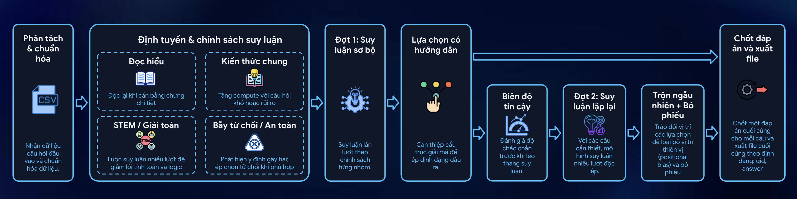

# VietMind MCQ - HackAIThon 2026


#### _Read this in Vietnamese_ <kbd><a href="../../README.md"></a></kbd>

An AI agent for Vietnamese multiple-choice questions, built around adaptive
reasoning for **[HackAIthon 2026](https://hackaithon.vsds.vn/) - Track C
(Innovator)**.

VietMind MCQ is Team Cow's 🐄 final competition build. It runs fully inside the
submission container, uses one local LLM, reads the test file from
`/code/private_test.json`, and writes `/code/submission.csv` plus
`/code/submission_time.csv`.

## I. Architecture



## II. Submission Checklist

| Requirement | Our Submission |
| --- | --- |
| Team | `Cow` 🐄 |
| Members | `Minh Le, Uyen Nguyen, Viet Nguyen` |
| Organization | `Denison University, The Ohio State University` |
| Competition | [HackAIthon 2026](https://hackaithon.vsds.vn/) |
| Model | `Qwen/Qwen3.5-4B` |
| Model limit | One open LLM under 5B parameters |
| Inference | Offline, one model only |
| Docker image | `powato/hackaithon-cow:latest` |
| Image size | ~16.2 GB |
| Final runner | `src/v03_gamma.py` |
| Official input | `/code/private_test.json` |
| Official output | `/code/submission.csv` and `/code/submission_time.csv` |
| Output columns | `submission.csv`: `qid,answer`; `submission_time.csv`: `qid,answer,time` |
| Target GPU | NVIDIA CUDA GPU with at least 16 GB VRAM |

## III. What This Does

The pipeline parses Vietnamese multiple-choice questions, routes them into
question types, runs route-aware reasoning with constrained answer extraction,
and writes one valid answer letter for every `qid`. In other words: the system
tries to spend extra thinking where it helps, then stays disciplined about
returning a clean submission file.

The final branch is `v03_gamma`. We chose it because it is the best practical
balance of public-set accuracy, runtime, and 16 GB VRAM reliability.

## IV. Core Idea

VietMind MCQ is built around adaptive reasoning: not every question deserves the
same amount of computation. Some items are direct knowledge checks, some require
careful reading, some involve STEM calculation, and some contain safety or
refusal patterns. The system first identifies the question type, then decides
how much extra reasoning to spend.

This design also comes from our own experience with **Vietnamese entrance-style
exams**. As high school students, we learned that not every multiple-choice
question should be handled the same way. A simple fact question can be answered
quickly. A math problem usually needs scratch work. A reading question often
requires going back to the passage. A confusing answer set may need comparing
similar options before choosing.

VietMind MCQ follows that same exam-taking instinct: answer fast when the
question is simple, and slow down when the structure suggests risk.

Each route is treated differently:

- `READING` questions can get reread-style self-consistency when details matter
- `STEM` questions receive more deliberate reasoning because small calculation
  errors can flip the answer
- `KNOWLEDGE` questions get extra compute when options are numerous, ambiguous,
  or structurally tricky
- `SAFETY` questions can use deterministic refusal-option handling when the
  question asks for unsafe behavior

## V. Results Summary

| Version | Public Score | Runtime On Our GPU |
| --- | --- | --- |
| `v02_gamma` | 85.31% | 12.77 s/question |
| `v03_alpha` | 84.23% | 3.87 s/question |
| `v03_gamma` | **85.96%** | 7.98 s/question |
| `v03_delta` | 87.04% | 27.53 s/question |

`v03_delta` scored higher on the public set, but it was much heavier and still
showed OOM risk on long smaller-memory runs. The submitted branch is therefore
`v03_gamma`.

Runtime numbers above were measured on our local 24 GB RTX-class GPU setup, so
they are useful for comparing versions, not for predicting exact judge runtime.
We do not recommend using NVIDIA T4 for official judging because T4 has very
tight memory margins, much slower inference, and may cause runtime mismatch or
Docker/vLLM execution issues.

**Important note:** The final submission settings are now adjusted for a 16 GB
VRAM GPU. For a private set of around 2000 questions, runtime can be very long,
especially on T4 or slower 16 GB GPUs. Please allocate enough wall-clock time;
if possible, use a GPU with more VRAM to reduce risk and runtime.

Full version notes: [docs/version_results.md](../version_results.md)

## VI. Reports

- Vietnamese report: [docs/report/report_vi.md](../report/report_vi.md)
- English report: [docs/report/report_en.md](../report/report_en.md)
- Presentation slides: [docs/report/presentation_slide.pdf](../report/presentation_slide.pdf)

## VII. Judge Run Instructions

### Requirements

- **NVIDIA CUDA GPU** with at least **16 GB** VRAM
  - Officially supported: NVIDIA Ampere or newer, for example RTX 3090/4090,
    RTX 4080 16 GB, RTX A4000/A5000/A6000, A100, L4/L40/L40S,
    or similar CUDA-capable GPUs
  - Technically supported but not recommended: Tesla T4 16 GB. Please do not
    use T4 for official judging if another GPU is available, because it can be
    too slow, too close to the memory limit, or cause Docker/vLLM runtime
    mismatch or execution failures
- Docker
- The `nvidia-container-toolkit` package, so `docker run --gpus all` works
- At least 25 GB free disk space recommended for the ~16.2 GB image plus
  extracted layers, cache, and output files

### Pull

```bash
docker pull powato/hackaithon-cow:latest
```

### Preflight Checks

Before running the submission, these checks should pass:

```bash
docker version
docker run --rm --gpus all nvidia/cuda:12.9.1-base-ubuntu22.04 nvidia-smi
df -h .
```

Expected:

- `docker version` shows both `Client` and `Server`
- `nvidia-smi` runs inside the CUDA container
- the current disk has enough free space for the Docker image and outputs

### Run

Mount the official test file to `/code/private_test.json` inside the container.
Do not mount a whole directory over `/code`, because that would hide the source
code already inside the image.

```bash
docker run --name cow-vietmind-run --gpus all --ipc=host \
  -v "$PWD/private_test.json:/code/private_test.json" \
  powato/hackaithon-cow:latest
```

After the run:

```text
/code/submission.csv
/code/submission_time.csv
```

For a local run, copy the files out and then remove the container:

```bash
docker cp cow-vietmind-run:/code/submission.csv ./submission.csv
docker cp cow-vietmind-run:/code/submission_time.csv ./submission_time.csv
docker rm cow-vietmind-run
```

should exist and contain:

```csv
qid,answer
```

```csv
qid,answer,time
```

### Accepted Input Names

The container checks input files in this order:

1. `/code/private_test.json`
2. `/code/private_test.csv`
3. `/data/private_test.csv`
4. `/data/public_test.csv`
5. `/data/private_test.json`
6. `/data/public_test.json`

The official BTC path is `/code/private_test.json`. The `/data/...` paths are
kept for older local compatibility. CSV input may use option columns such as
`A,B,C,D,...`; questions with more than four choices are supported.

## VIII. Developer Run Instructions

Install dependencies:

```bash
python3.11 -m venv venv
source venv/bin/activate
pip install -r requirements.txt
```

Run the final pipeline locally:

```bash
python src/v03_gamma.py \
  --input data/public-test_1780368312.json \
  --output data/submissions/submission_v03_gamma.csv \
  --trace-output data/traces/trace_v03_gamma.jsonl \
  --safe-mode
```

Run the same entrypoint style as Docker:

```bash
./run.sh data/private_test.csv output/submission.csv output/trace.jsonl output/submission_time.csv
```

Run tests:

```bash
python3.11 -m pytest
```

## IX. Frequent Issues

See [docs/faq.md](../faq.md) for practical setup fixes, including:

- Docker daemon not running
- manual Docker startup in restricted notebook/cloud environments
- `docker run --gpus all` not working
- not enough disk space for the Docker image
- `vLLM unavailable`
- missing input file inside `/data`

## X. Notes

- The final path is offline at inference time.
- The final path uses one open LLM only: `Qwen/Qwen3.5-4B`, under the 5B
  parameter limit.
- No RAG, embedding model, reranker, semantic-router model, or second LLM is
  used.
- Runtime settings live in
  [configs/pipeline_config.yaml](../../configs/pipeline_config.yaml).

## XI. Acknowledgements

Thank you to HackAIthon 2026, Hội Sinh Viên Việt Nam, VSDS, Vietcombank, and
VNPT AI for creating this competition and giving students a place to build,
test, and learn about AI Agent.
